# Table of Contents

1. [Overview](#overview)
2. [Features](#features)
   1. [General](#general)
   2. [Owner Side](#owner-side)
   3. [Student Side](#student-side)
3. [Structure of the Project](#structure-of-the-project)
   1. [Files and Folders](#files-and-folders)
   2. [Database Structure](#database-structure)
   3. [UML Class Diagram](#uml-class-diagram)
   4. [Sequence Diagram](#sequence-diagram)
      1. [Sign Up](#sign-up)
      2. [Login](#login)
      3. [Room Management](#room-management)
      4. [Reservation Management](#reservation-management)
      5. [Favorites](#favorites)
   5. [Data Flow Analysis](#data-flow-analysis)
      1. [Complete](#complete)
      2. [Connexion and Display of the Rooms](#connexion-and-display-of-the-rooms)
      3. [Booking and Handling of the Reservation](#booking-and-handling-of-the-reservation)
4. [Technologies and Libraries](#technologies-and-libraries)
   1. [Backend Technologies](#backend-technologies)
   2. [Frontend Technologies](#frontend-technologies)
   3. [Additional Libraries](#additional-libraries)
   4. [Development Tools](#development-tools)
5. [Team](#team)
6. [Setup the Project (Local)](#setup-the-project-local)
   1. [Setup Frontend](#setup-frontend)
   2. [Setup Backend](#setup-backend)
   3. [Running Development Servers](#running-development-servers)
      1. [Frontend](#frontend)
      2. [Backend](#backend)

# 🌟 Overview

The project is a web application that allows students to book a room and an owner to rent a room. You can access the application [here](https://13-air-ajtd.rxq.ch/#/).

# 🚀 Features

We made the decision to have one user, so as not to separate the owner and the students. It was a choice at the beginning of the project, to make development easier. So, a user can be both an owner and a student. The main features are:

### 🔄 General

- **Sign up**: Email confirmation is sent after the sign-up process.
- **Login**: Reset password with an email.
- **Logout**
- **Manage personal data**:
  - Change password
  - Change first name, last name, username
  - Cannot change email
- **View list of rooms**:
  - Availability integrated directly into the calendar
- **View reviews and ratings of rooms**
- **View public profile of a reviewer**
- **Search room based on filters/search**
- **Add a room to favorites**
- **View location of a room (with a map)**

### 🏠 Owner Side

- **Create a room** with the following details:
  - Name, description, price, features
  - Location
  - Disabled dates
  - Images
- **Manage rooms**:
  - Modify
  - Delete
- **Manage reservations**:
  - Accept/refuse a reservation
  - View list of current reservations
  - View list of past reservations
- **Review and rate a room** after the reservation has been made

### 🎓 Student Side

- **Book a room**:
  - Choose the number of guests (max. 20)
  - Receive notification when the booking is sent and accepted/refused
- **Review and rate a room** after the reservation has been made

# 📂 Structure of the Project

## Files and Folders

```markdown
.
├── .browserslistrc
├── .eslintrc.cjs
├── .gitignore
├── .prettierrc.json
├── .vscode/
│ └── extensions.json
├── babel.config.js
├── backend/
│ ├── **init**.py
│ ├── **pycache**/
│ ├── api/
│ │ ├── **init**.py
│ │ ├── **pycache**/
│ │ ├── admin.py
│ │ ├── apps.py
│ │ └── migrations/
│ ├── asgi.py
│ ├── media/
│ ├── settings/
│ ├── urls.py
│ └── wsgi.py
├── db.sqlite3
├── index.html
├── manage.py
├── media/
│ └── room_pictures/
├── package.json
├── public/
├── readme.md
├── requirements.txt
├── src/
│ ├── App.vue
│ ├── assets/
│ ├── components/
│ ├── main.js
│ ├── router/
│ ├── services/
│ └── views/
├── team.md
├── venv/
│ ├── Include/
│ ├── Lib/
│ ├── pyvenv.cfg
│ └── Scripts/
└── vite.config.js
```

## 🗄️ Database structure

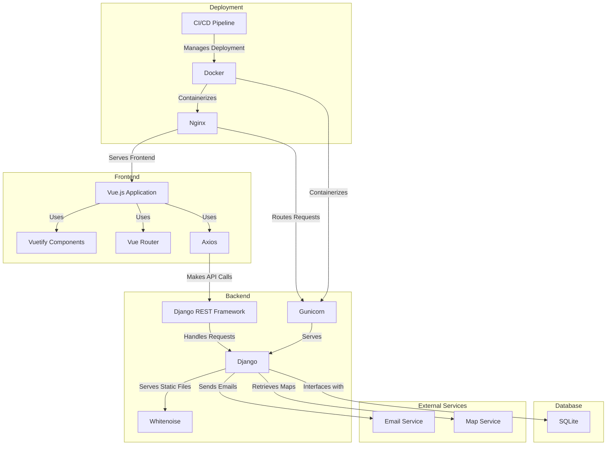

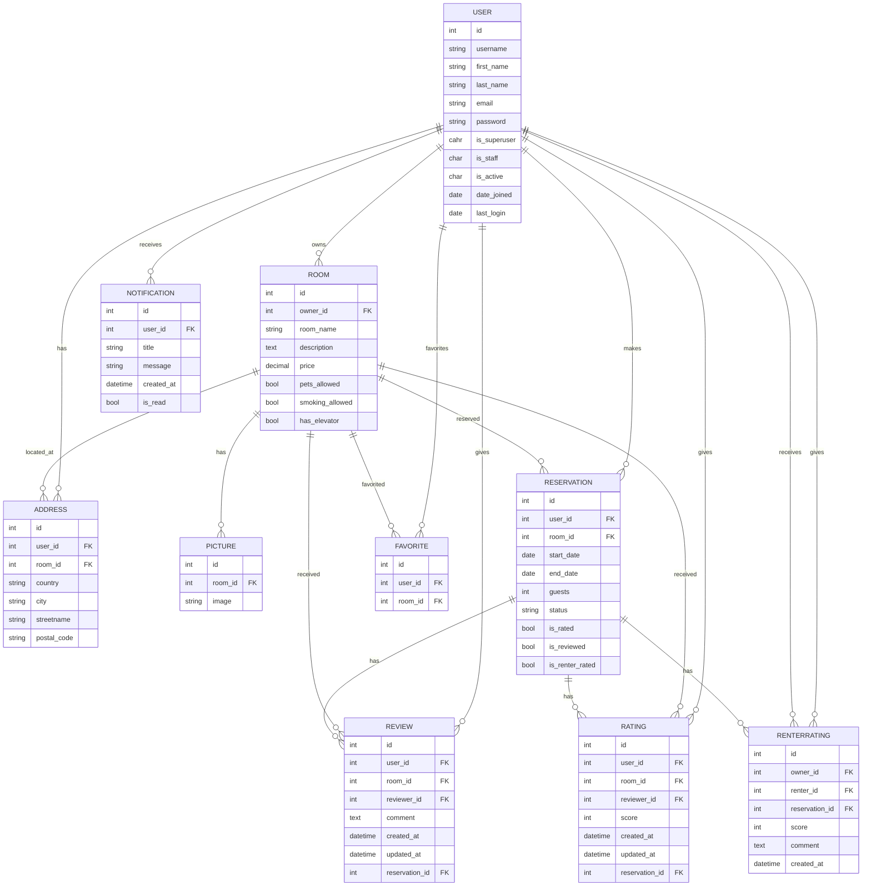

### 🛠 UML class diagram

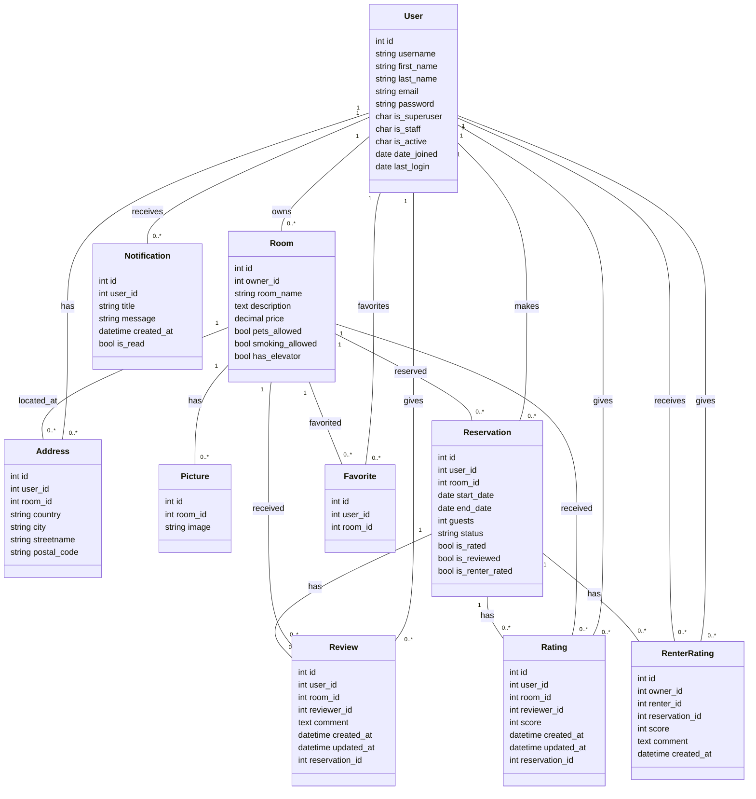

## 📋 Sequence diagram

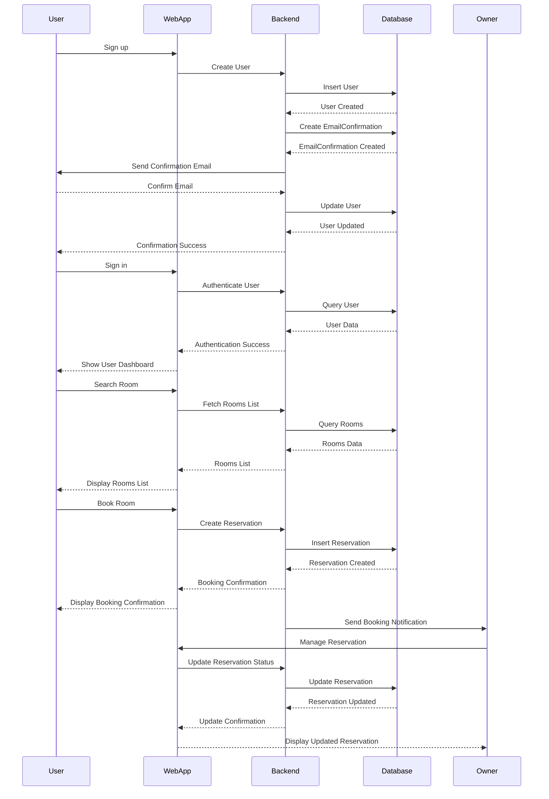

### sign up

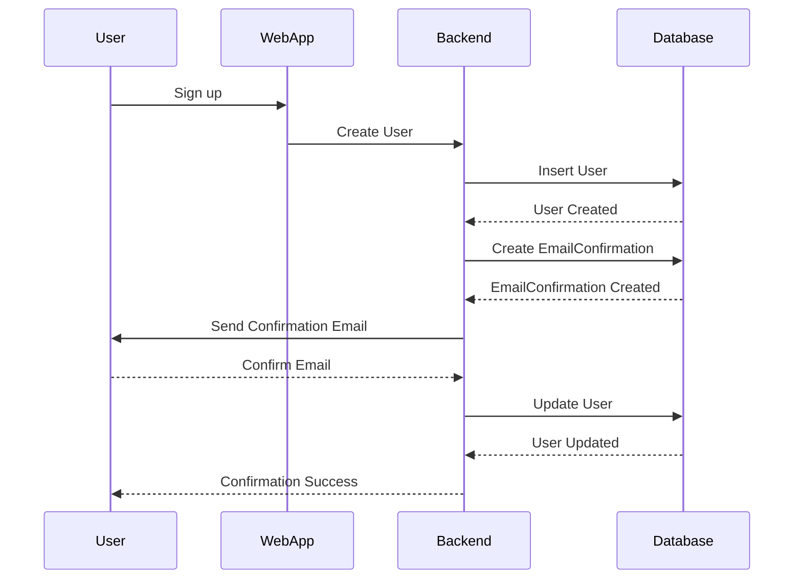

### login

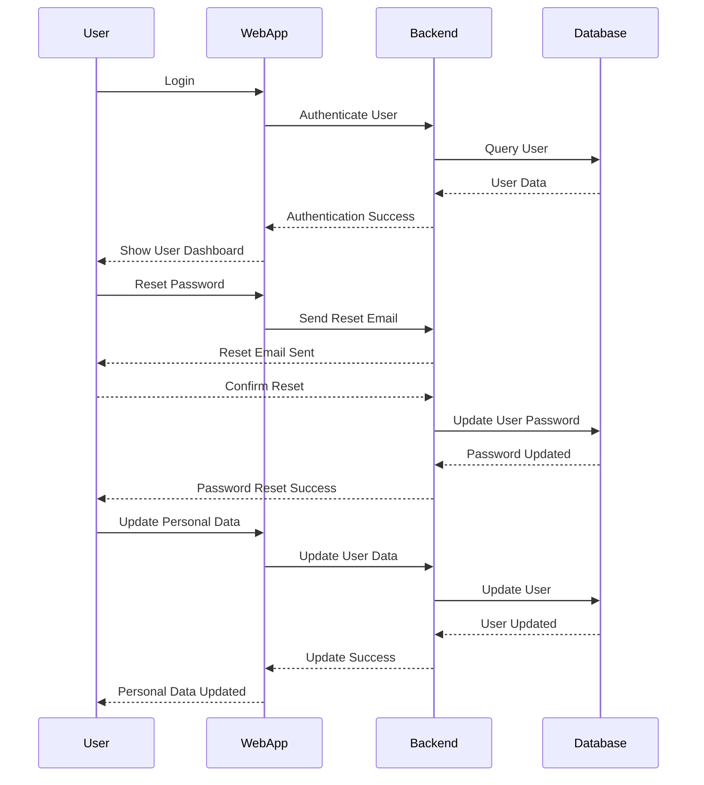

### room management

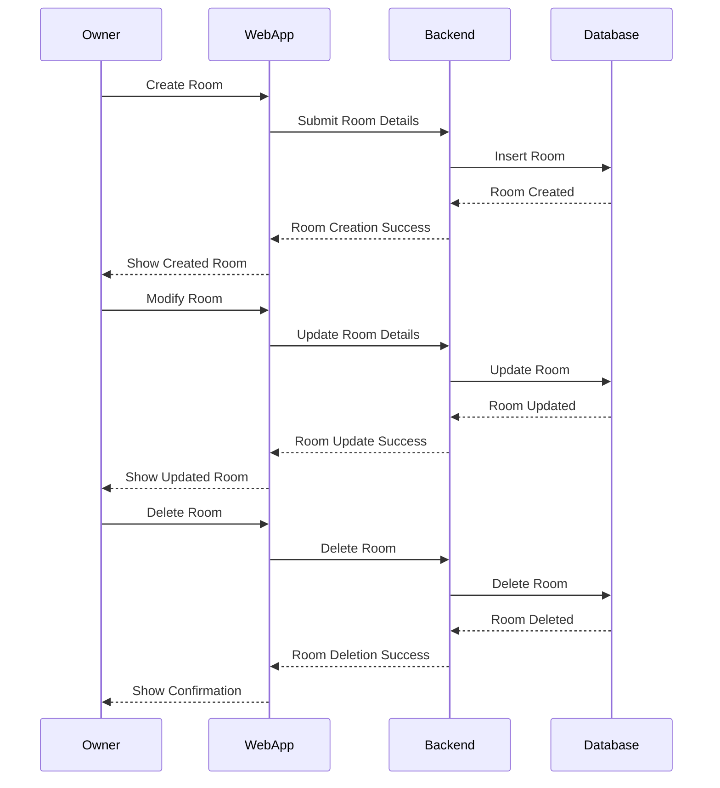

### reservation management

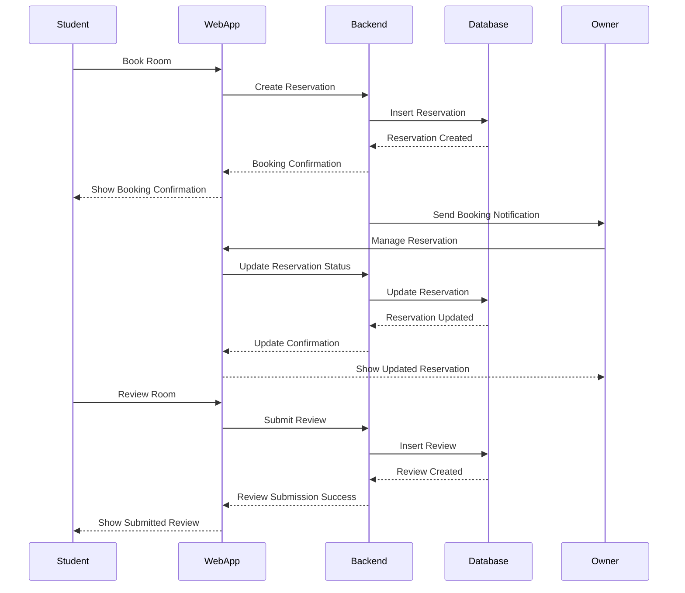

### favorites

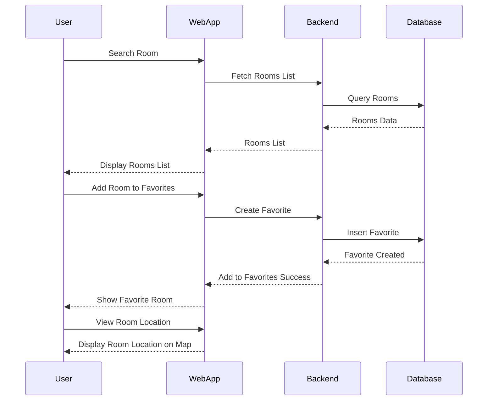

## Data flow analysis

### complete

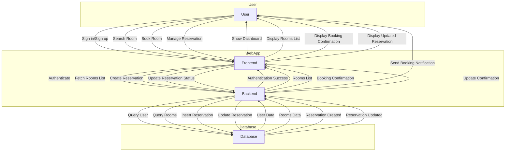

### connexion and display of the rooms

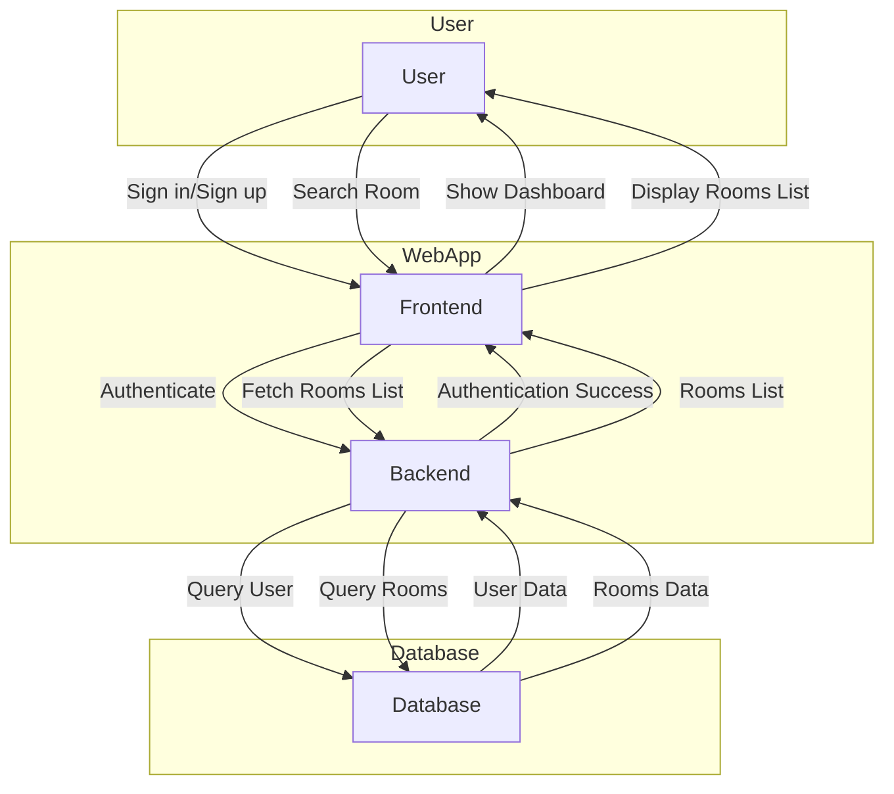

### booking and handling of the reservation

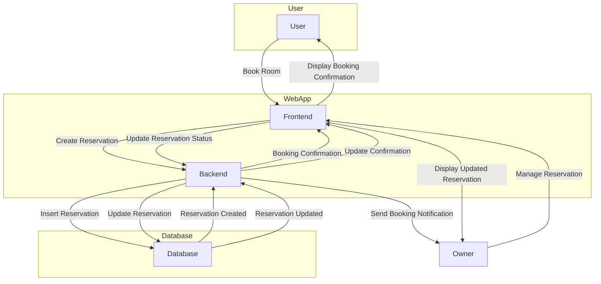

# 🛠️ Technologies and Libraries

### Backend Technologies

1. **Django (v5.0.4)**: Django is a high-level Python web framework that encourages rapid development and clean, pragmatic design. It handles much of the complexity of web development, making it easier to build secure and maintainable web applications.
2. **Django REST Framework (v3.15.1)**: This is a powerful and flexible toolkit for building Web APIs in Django. It provides a wide range of functionalities like serialization, authentication, and viewsets to create RESTful APIs efficiently.
3. **Psycopg2-binary (v2.9.9)**: As I understand, this requirements is for the production. Psycopg2 is the most popular PostgreSQL database adapter for the Python programming language. This binary package includes everything needed to connect Django to a PostgreSQL database.
4. **dj-database-url (v2.1.0)**: This library allows easy configuration of database connections in Django, especially useful when deploying on cloud platforms.
5. **Gunicorn (v21.2.0)**: Gunicorn is a Python WSGI HTTP Server for UNIX. It’s a pre-fork worker model, which means it is highly suitable for handling multiple requests in a concurrent fashion.
6. **Whitenoise (v6.6.0)**: Whitenoise provides static file serving for WSGI applications. It is designed to integrate with Django to simplify the process of serving static files in production.
7. **Django CORS Headers (v4.3.1)**: This library helps in handling Cross-Origin Resource Sharing (CORS) for the Django application. It is essential for allowing frontend applications hosted on different domains to interact with the Django backend.
8. **dj-rest-auth (with social)**: This library provides a set of REST API endpoints to handle user authentication in Django, including social authentication. The version used is a specific commit from a GitHub repository that ensures compatibility with Django 5.
9. **Django REST Framework SimpleJWT (v5.3.1)**: SimpleJWT provides JSON Web Token (JWT) authentication for Django REST Framework, enabling secure token-based authentication.
10. **Pillow (v10.3.0)**: Pillow is a Python Imaging Library (PIL) fork that adds image processing capabilities to your Django application, such as handling uploads, image manipulation, and conversions.

### Frontend Technologies

1. **Vue.js (v3.4.27)**: Vue.js is a progressive JavaScript framework used for building user interfaces. It is designed to be incrementally adoptable, making it versatile for various project scales.
2. **Vite (v5.2.8)**: Vite is a next-generation front-end tool that significantly improves the speed and efficiency of web development. It provides fast and lean development and build processes.
3. **Vue Router (v4.3.0)**: Vue Router is the official router for Vue.js, enabling developers to create single-page applications with multiple views.
4. **Vuetify (v3.6.5)**: Vuetify is a Vue UI library with beautifully handcrafted material components, providing a consistent and elegant design system.
5. **Bootstrap (v5.3.3)**: Bootstrap is a popular CSS framework for developing responsive and mobile-first web pages.
6. **Bootstrap-Vue (v2.23.1)**: Bootstrap-Vue provides comprehensive Bootstrap 4 support for Vue.js.
7. **Axios (v1.6.8)**: Axios is a promise-based HTTP client for the browser and Node.js, used to make HTTP requests from the frontend to the backend.
8. **ESLint (v8.57.0)**: ESLint is a static code analysis tool for identifying problematic patterns found in JavaScript code.
9. **Prettier (v3.2.5)**: Prettier is an opinionated code formatter that enforces a consistent style by parsing code and re-printing it.

### Additional Libraries

1. **@chenfengyuan/vue-number-input (v2.0.1)**: A number input component for Vue.js applications.
2. **@coreui/coreui (v5.0.1) and @coreui/vue (v5.0.0)**: CoreUI is a UI library providing a set of customizable components for Vue.js.
3. **@fortawesome/fontawesome-free (v6.5.2)**: Font Awesome is a popular icon library used for adding vector icons and social logos to web projects.
4. **@vueform/slider (v2.1.10)**: A slider component for Vue.js, which allows users to select a value from a range.
5. **@vuepic/vue-datepicker (v8.5.1)**: A date picker component for Vue.js applications.
6. **@vueuse/core (v10.10.0)**: A collection of essential Vue Composition Utilities, allowing developers to compose logical concerns of an application.
7. **Leaflet (v1.9.4)**: An open-source JavaScript library for mobile-friendly interactive maps.

### Development Tools

1. **@rushstack/eslint-patch (v1.10.1)**: This library is used to provide patches for ESLint configuration.
2. **@vitejs/plugin-vue (v5.0.4)**: This Vite plugin provides Vue.js support.
3. **@vue/eslint-config-prettier (v9.0.0)**: This configuration disables all ESLint rules that are unnecessary or might conflict with Prettier.

# 📝 Team

The project was developed by a team of four students from the HES-SO :

[team](./team.md)

# 🚀 setup the project (local)

```bash
$ git clone https://github.com/cutiips/g-13-air-ajtd.git
$ cd g-13-air-ajtd
```

## Setup frontend

```bash
$ npm install
```

## Setup backend

```bash
$ python -m venv venv
# On windows
$ .\venv\Scripts\Activate.ps1

# On linux
$ source venv/bin/activate

$ pip install -r requirements.txt
$ python manage.py migrate
$ python manage.py createsuperuser --email admin@example.com --username admin
```

## Running Development Servers

### Frontend

```bash
$ npm run dev
```

From another tab in the same directory:

### Backend

```bash
$ python manage.py runserver
```

The project will be served from [`localhost:5173`](http://localhost:5173/) and the Django API
and static files will be served from [`localhost:8000`](http://localhost:8000/).

The dual dev server setup allows you to take advantage of
vite's development server with hot module replacement.

This requires cors to be configured correctly in Django.
